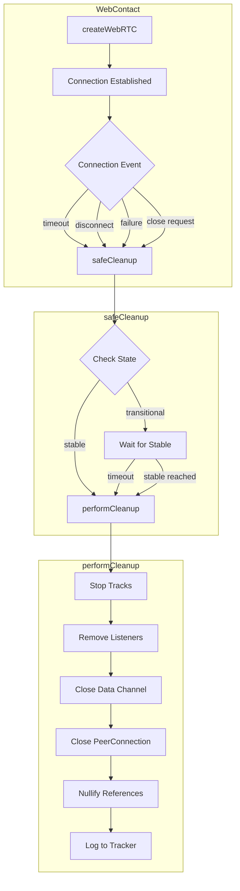
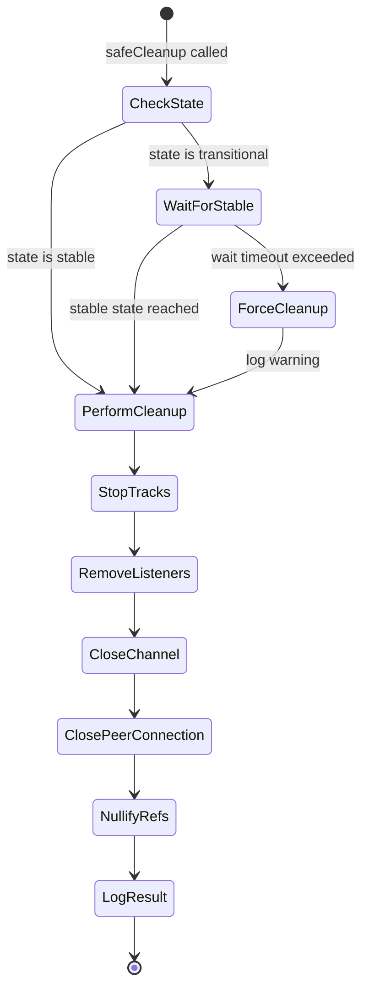

# Design Document: WebRTC Resource Cleanup

## Overview

This design addresses WebRTC resource leaks in the KDHT project by implementing proper cleanup procedures following WebRTC best practices. The core insight from WebRTC experts is that connections should only be closed when in stable states (connected, failed, closed), not during transitional states (connecting, disconnecting), and cleanup must follow a specific order: stop tracks → remove event listeners → close connection → nullify references.

The implementation modifies the existing `WebContact` class to add state-aware cleanup, comprehensive resource release, and enhanced monitoring through the existing `ConnectionTracker` class.

## Architecture



## Components and Interfaces

### 1. WebContact Class Extensions

The `WebContact` class in `contacts/webrtc.js` will be extended with new cleanup methods:

```javascript
class WebContact extends Contact {
  // Existing properties
  webrtc;           // WebRTC instance
  connection;       // Promise for data channel
  closed;           // Promise that resolves when closed
  unsafeData;       // Direct reference to data channel
  
  // New properties for cleanup tracking
  _eventListeners = new Map();  // Track registered listeners for removal
  _cleanupInProgress = false;   // Prevent concurrent cleanup
  
  // New methods
  async safeCleanup(reason);           // State-aware cleanup entry point
  async waitForStableState(timeout);   // Wait for non-transitional state
  performCleanup(reason);              // Execute cleanup in correct order
  registerListener(target, event, handler);  // Track listeners for removal
  removeAllListeners();                // Remove all tracked listeners
}
```

### 2. ConnectionTracker Extensions

The existing `ConnectionTracker` class will be extended with resource monitoring:

```javascript
class ConnectionTracker {
  // Existing properties
  static events = [];
  static maxEvents = 1000;
  static enabled = false;
  
  // New properties
  static activeConnections = 0;
  static cleanupSuccesses = 0;
  static cleanupFailures = 0;
  
  // New methods
  static trackConnectionCreated();
  static trackConnectionClosed(success, reason);
  static getResourceStats();
}
```

### 3. Cleanup State Machine



## Data Models

### Connection State Classification

```javascript
const ConnectionStates = {
  // Transitional states - unsafe to close
  TRANSITIONAL: ['new', 'connecting', 'disconnected'],
  
  // Stable states - safe to close
  STABLE: ['connected', 'failed', 'closed'],
  
  isTransitional(state) {
    return this.TRANSITIONAL.includes(state);
  },
  
  isStable(state) {
    return this.STABLE.includes(state);
  }
};
```

### Cleanup Result

```javascript
const CleanupResult = {
  reason: string,        // 'timeout' | 'disconnect' | 'failure' | 'shutdown' | 'close'
  success: boolean,
  connectionState: string,
  waitedForStable: boolean,
  forceCleanup: boolean,
  error: string | null,
  duration: number       // ms
};
```

### Resource Statistics

```javascript
const ResourceStats = {
  activeConnections: number,
  totalCreated: number,
  totalClosed: number,
  cleanupSuccesses: number,
  cleanupFailures: number,
  averageCleanupTime: number,
  lastCleanupError: string | null
};
```


## Correctness Properties

*A property is a characteristic or behavior that should hold true across all valid executions of a system—essentially, a formal statement about what the system should do. Properties serve as the bridge between human-readable specifications and machine-verifiable correctness guarantees.*

### Property 1: State-Aware Cleanup Behavior

*For any* WebContact with an active connection, when safeCleanup is called, the cleanup behavior SHALL match the connection state classification: if the state is transitional (connecting, disconnected), cleanup waits for a stable state; if the state is stable (connected, failed, closed), cleanup proceeds immediately.

**Validates: Requirements 1.1, 1.2**

### Property 2: Cleanup Completeness

*For any* WebContact that undergoes cleanup (via timeout, disconnect, failure, or shutdown), after cleanup completes: the `webrtc` property SHALL be null, the `connection` property SHALL be null, the `unsafeData` property SHALL be null, and no event listeners SHALL remain registered on the former RTCPeerConnection or DataChannel.

**Validates: Requirements 2.2, 2.3, 2.4, 3.3, 3.4, 4.2**

### Property 3: Cleanup Order Correctness

*For any* WebContact cleanup operation, the cleanup steps SHALL execute in the following order: (1) stop media tracks, (2) remove event listeners, (3) close data channel, (4) close peer connection, (5) nullify references. No step SHALL execute before its predecessor completes.

**Validates: Requirements 2.1, 2.5**

### Property 4: Tracker Count Accuracy

*For any* sequence of connection create and cleanup operations, the ConnectionTracker's `activeConnections` count SHALL equal the actual number of non-null WebRTC connections, and `cleanupSuccesses + cleanupFailures` SHALL equal the total number of cleanup operations performed.

**Validates: Requirements 3.2, 4.3, 5.1, 5.2**

### Property 5: Contact Removal on Unexpected Disconnect

*For any* WebContact where the remote peer disconnects unexpectedly (connection state changes to 'failed' or 'disconnected' without local initiation), the contact SHALL be removed from the host's routing table (buckets or looseContacts).

**Validates: Requirements 4.4**

### Property 6: Complete Shutdown Cleanup

*For any* Node with N active WebContact connections, when disconnect() is called, the returned promise SHALL not resolve until all N connections have completed cleanup, and after resolution, no WebContact SHALL have a non-null `webrtc` property.

**Validates: Requirements 6.1, 6.2**

## Error Handling

### Cleanup Timeout Handling

When waiting for a stable state exceeds the maximum wait time (default: 5000ms):
1. Log a warning with connection details to ConnectionTracker
2. Force cleanup regardless of current state
3. Track as a cleanup success (resources released) but log the forced nature

```javascript
async waitForStableState(maxWaitMs = 5000) {
  const start = Date.now();
  while (Date.now() - start < maxWaitMs) {
    const state = this.webrtc?.pc?.connectionState;
    if (!state || ConnectionStates.isStable(state)) {
      return { waited: true, forced: false };
    }
    await Node.delay(100);
  }
  ConnectionTracker.log('cleanup_forced', {
    from: this.host?.contact?.sname,
    to: this.sname,
    state: this.webrtc?.pc?.connectionState,
    waitedMs: maxWaitMs
  });
  return { waited: true, forced: true };
}
```

### Cleanup Failure Handling

If any step in performCleanup throws an exception:
1. Log the error with full context to ConnectionTracker
2. Continue with remaining cleanup steps (best effort)
3. Nullify references regardless of errors
4. Increment cleanupFailures counter

```javascript
performCleanup(reason) {
  let success = true;
  try {
    // Stop tracks
    this.webrtc?.pc?.getSenders?.()?.forEach(sender => {
      try { sender.track?.stop(); } catch (e) { /* ignore */ }
    });
  } catch (e) {
    success = false;
    ConnectionTracker.log('cleanup_error', { step: 'stop_tracks', error: e.message });
  }
  // ... continue with other steps
  
  // Always nullify references
  this.webrtc = this.connection = this.unsafeData = null;
  
  ConnectionTracker.trackConnectionClosed(success, reason);
}
```

### Concurrent Cleanup Prevention

If safeCleanup is called while cleanup is already in progress:
1. Return immediately without starting another cleanup
2. The original cleanup will complete and release resources

```javascript
async safeCleanup(reason) {
  if (this._cleanupInProgress) return;
  this._cleanupInProgress = true;
  try {
    // ... cleanup logic
  } finally {
    this._cleanupInProgress = false;
  }
}
```

## Testing Strategy

### Dual Testing Approach

This feature requires both unit tests and property-based tests:

- **Unit tests**: Verify specific scenarios like timeout handling, error recovery, and edge cases
- **Property tests**: Verify universal properties hold across all connection states and cleanup scenarios

### Property-Based Testing Configuration

- **Library**: fast-check (JavaScript property-based testing library)
- **Iterations**: Minimum 100 iterations per property test
- **Tag format**: `Feature: webrtc-resource-cleanup, Property N: {property_text}`

### Test Categories

1. **State Classification Tests**
   - Generate random connection states
   - Verify correct classification as transitional or stable
   - Verify cleanup behavior matches classification

2. **Cleanup Completeness Tests**
   - Generate connections with various configurations
   - Trigger cleanup via different paths (timeout, disconnect, failure)
   - Verify all references nullified and no listeners remain

3. **Cleanup Order Tests**
   - Mock cleanup steps to track execution order
   - Verify order matches specification for any cleanup trigger

4. **Tracker Accuracy Tests**
   - Generate random sequences of create/cleanup operations
   - Verify tracker counts match actual state

5. **Integration Tests**
   - Test with real WebRTC connections (existing testWebrtc.js patterns)
   - Verify no resource leaks after connection lifecycle

### Test File Structure

```
spec/
  rdht/
    webrtcCleanupSpec.js       # Property tests for cleanup behavior
    connectionTrackerSpec.js   # Property tests for tracker accuracy
```
